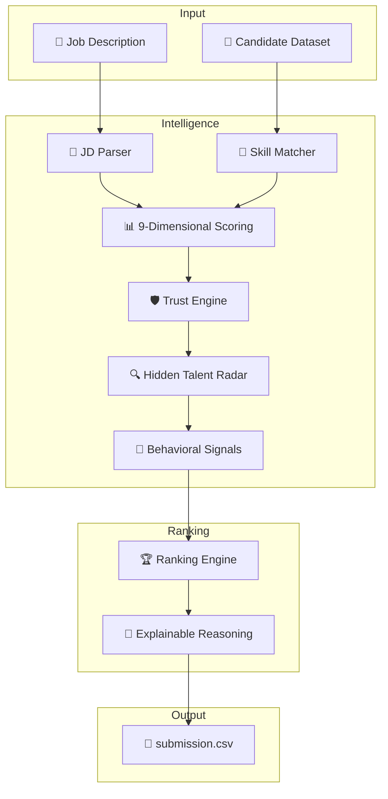
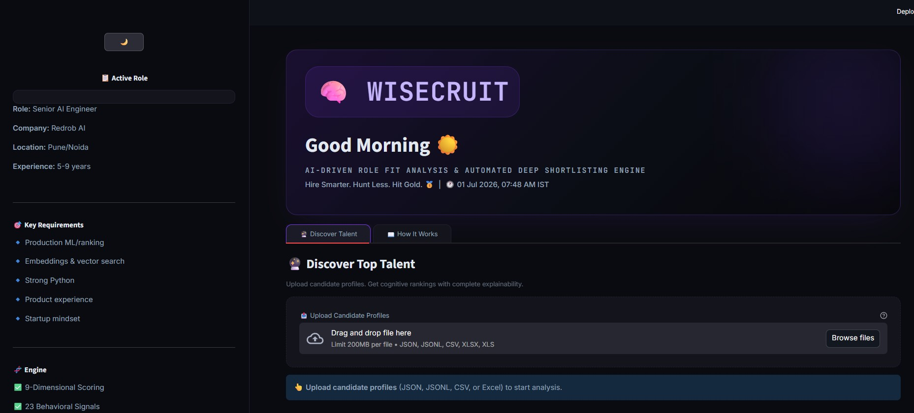
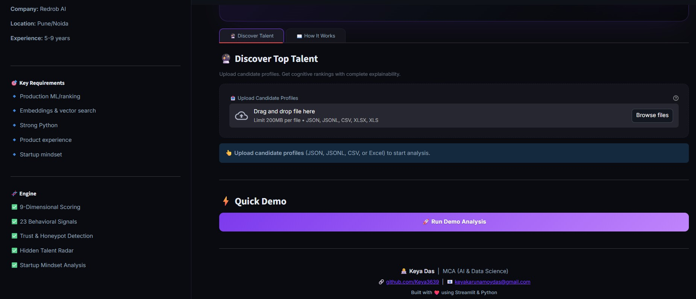
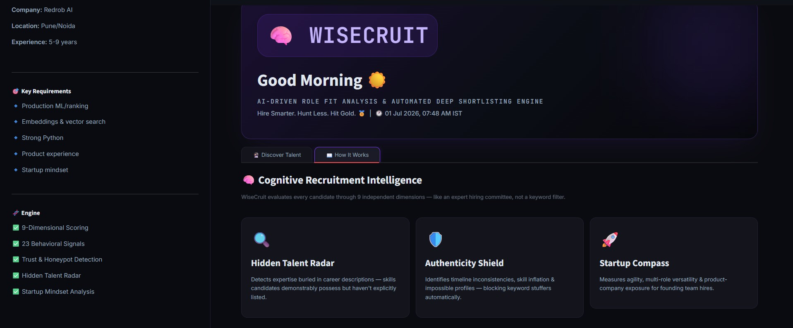
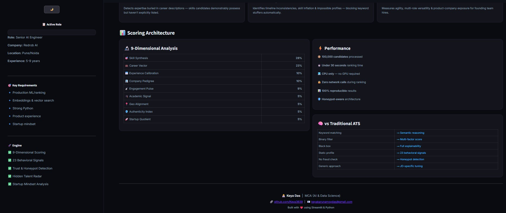
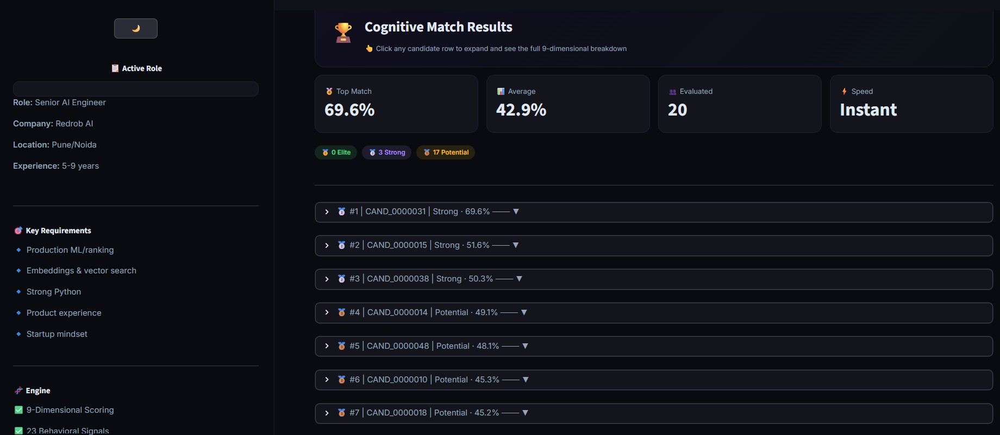
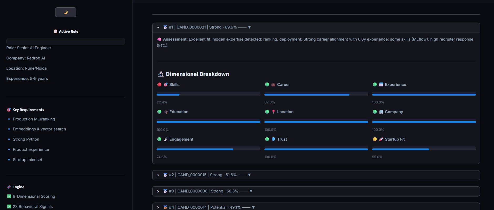
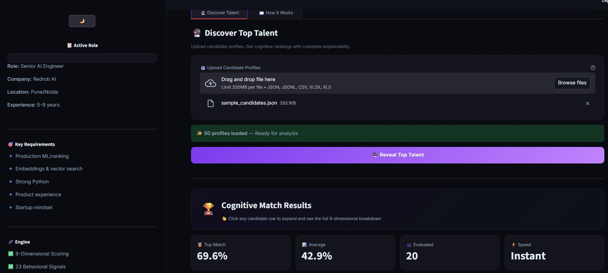
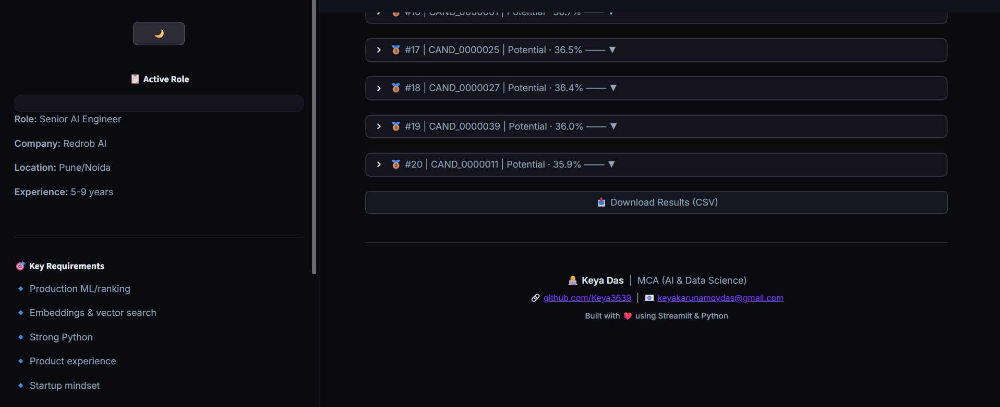

<!-- WiseCruit Banner -->
<div align="center">
  <h1>🧠 WiseCruit</h1>
  <h2>Smart Role Fit Analysis & Automated Deep Shortlisting Engine</h3>
  <p>
    <strong>Hire Smarter. Hunt Less. Hit Gold. 🥇</strong>
  </p>
</div>

---

<div align="center">

⭐ **AI Recruitment Platform** &nbsp;|&nbsp;
🧠 **9-Dimensional Scoring** &nbsp;|&nbsp;
⚡ **Python + Streamlit** &nbsp;|&nbsp;
🛡️ **Honeypot Detection** &nbsp;
</div>

---

<p align="center">


</p>

---

# 🏗 System Architecture

WiseCruit follows a modular AI pipeline that transforms an unstructured Job Description into explainable candidate rankings through intelligent parsing, multi-dimensional evaluation, fraud detection, and behavioral analysis.



### 🔄 Application Workflow

1. Parse the Job Description.
2. Load candidate profiles.
3. Calculate 9-dimensional scores.
4. Detect hidden talent.
5. Verify authenticity.
6. Analyze behavioral signals.
7. Rank candidates.
8. Generate explanations.
9. Export submission.csv.

---

# 📊 Feature Comparison

| Feature | Traditional ATS | WiseCruit |
|:---|:---:|:---:|
| Resume Matching | Keyword Based | ✅ AI Multi-Dimensional |
| Explainability | ❌ | ✅ Detailed Reasoning |
| Hidden Talent Detection | ❌ | ✅ Career Description Analysis |
| Fraud Detection | ❌ | ✅ Honeypot Detection |
| Behavioral Analysis | ❌ | ✅ 23 Behavioral Signals |
| Startup Fit | ❌ | ✅ Startup Quotient |
| Company Pedigree | ❌ | ✅ Consulting Detection |
| Ranking Quality | Basic | ✅ Weighted Cognitive Ranking |
| Processing | Cloud Dependent | ✅ CPU Only |
| Output | Candidate List | ✅ Ranked CSV + Reasoning |

---

# ✨ Core Features

## 🧠 JD Intelligence Engine

- Skill Extraction
- Experience Detection
- Disqualifier Recognition
- Startup Signal Identification
- Role Understanding

---

## 🎯 9-Dimensional Cognitive Scoring

| Dimension | Weight |
|:--|--:|
| Skill Synthesis | 28% |
| Career Vector | 23% |
| Experience Calibration | 10% |
| Company Pedigree | 10% |
| Engagement Pulse | 9% |
| Academic Signal | 5% |
| Geo Alignment | 5% |
| Authenticity Index | 5% |
| Startup Quotient | 5% |

---

## 🔍 Hidden Talent Radar

- Finds implicit skills
- Reads work descriptions
- Detects production ML experience
- Detects ranking systems
- Detects deployment experience

---

## 🛡 Authenticity Shield

Detects:

- Timeline inconsistencies
- Skill inflation
- Keyword stuffing
- Fake experience
- Honeypot candidates

---

## 📡 Behavioral Intelligence

Analyzes 23 recruiter behavior signals including:

- Response Rate
- Interview Completion
- Recruiter Interest
- GitHub Activity
- Notice Period
- Open To Work
- Offer Acceptance

---

## 💬 Explainable AI

Every recommendation contains:

- Why selected
- Strengths
- Weaknesses
- JD alignment
- Honest reasoning

---

# 🛠 Technology Stack

| Layer | Technology |
|:---|:---|
| Language | Python 3.13 |
| UI | Streamlit |
| AI | Sentence Transformers |
| Data | Pandas + NumPy |
| ML | Scikit-Learn |
| Excel | OpenPyXL |
| Config | YAML |
| Deployment | Streamlit Cloud |
| Version Control | Git & GitHub |

---

# 📂 Project Structure

```text
WiseCruit/
│
├── app.py
├── rank.py
│
├── engine/
│   ├── loader.py
│   ├── jd_parser.py
│   ├── scorer.py
│   ├── reasoning.py
│   └── ranker.py
│
├── output/
│   └── submission.csv
│
├── requirements.txt
├── submission_metadata.yaml
├── README.md
```

---
---

# 📸 Application Preview

## 🏠 Dashboard

 
---
---
  
---
---
 
---
---
 
---
---
 
---
---
 
---
---
 
---
---
 
---
---
  
---
## 📄 Final Ranked Output


---


---

The screenshots above showcase WiseCruit's complete recruitment workflow—from Job Description understanding and AI-driven candidate evaluation to explainable ranking, trust analysis, behavioral intelligence, and final candidate shortlisting.

---
# 🚀 Live Demo

<div align="center">

## 🌐 Try WiseCruit

https://wisecruit-aknytfr5zvekm86rnqkwu9.streamlit.app/

</div>

---

# ⚙ Installation

## Prerequisites

- Python 3.11+
- pip

### Clone Repository

```bash
git clone https://github.com/Keya3639/WiseCruit.git

cd WiseCruit
```

### Install Dependencies

```bash
pip install -r requirements.txt
```

### Run Ranking

```bash
python rank.py --candidates candidates.jsonl --out submission.csv
```

### Run Demo

```bash
streamlit run app.py
```

---

# 🚀 Demo Workflow

| Step | Action |
|:--:|:---|
| 1 | Load Job Description |
| 2 | Upload Candidate Dataset |
| 3 | Run AI Ranking |
| 4 | View Candidate Scores |
| 5 | Inspect AI Reasoning |
| 6 | Download submission.csv |

---

# 🌟 Why WiseCruit?

Unlike traditional Applicant Tracking Systems, **WiseCruit reasons about talent instead of matching keywords.**

It helps recruiters:

- 🧠 Understand candidates deeply
- 🔍 Discover hidden talent
- 🛡 Detect fraudulent profiles
- 📡 Evaluate behavioral signals
- 💬 Explain every recommendation
- ⚡ Rank 100K candidates efficiently

**WiseCruit doesn't just rank resumes—it understands them.**

---

# 🔮 Future Enhancements

| Phase | Features |
|:---|:---|
| Phase 1 | Conversational Recruiter AI |
| Phase 2 | Interview Question Generator |
| Phase 3 | Skill Gap Prediction |
| Phase 4 | Talent Knowledge Graph |
| Phase 5 | ATS Integration |
| Phase 6 | Multilingual Resume Intelligence |

---

# 👩‍💻 Developer

## Keya Das

**MCA (AI & Data Science)**

**GitHub**

https://github.com/Keya3639

**Email**

keyakarunamoydas@gmail.com

---

# 🙏 Acknowledgements

- 🧠 Sentence Transformers
- 🎨 Streamlit
- 🐍 Python
- 🐼 Pandas
- 📊 NumPy
- 🤖 Scikit-Learn
- 🌍 Open Source Community

---

<div align="center">

# 🧠 WiseCruit

### Hire Smarter. Hunt Less. Hit Gold. 🥇

**Built with ❤️ using**

**Python • Streamlit • Sentence Transformers • Pandas • NumPy • Scikit-Learn**

</div>
